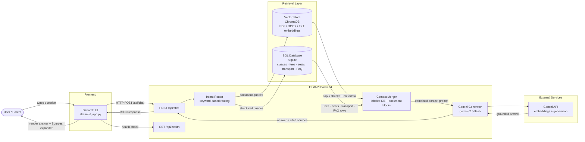

# Admission Enquiry Assistant

A RAG-powered school ERP admission assistant for **Greenfield International School** (Nursery–Grade 10). Parents can ask about seat availability, fees, transport routes, policies, and application procedures. Answers are grounded in **live SQLite data** and **retrieved document chunks** (prospectus, admission policy, fee structure, FAQs, timings), then synthesized by **Google Gemini** with cited sources.

## Architecture



> Source file: [`docs/architecture.mmd`](docs/architecture.mmd) · Rendered PNG: [`docs/architecture.png`](docs/architecture.png)

### Request flow (step by step)

1. **User** asks a question in the Streamlit chat UI (or clicks a sample question).
2. **Streamlit** sends `POST /api/chat` with `{ "query": "...", "session_id": "..." }`.
3. **Intent router** (`app/rag/generator.py`) uses keyword rules to decide whether the query needs database lookup, document retrieval, or both.
4. **ChromaDB** returns top-k embedded chunks from PDF/DOCX/TXT sources with `source_file`, `page_number`, and similarity score.
5. **SQLite** returns structured rows for classes, fees, seat counts, transport routes, and FAQs.
6. **Context merger** builds a single labeled prompt (`[Database] …` / `[Document: fee_structure.pdf] …`).
7. **Gemini** generates an answer strictly from that context and cites which sources were used.
8. **Response** (`answer` + `sources`) is rendered in the UI with a collapsible **Sources** section.

## Project structure

```
admission-enquiry-assistant/
├── app/
│   ├── main.py              # FastAPI app + CORS + lifespan
│   ├── config.py            # Settings via python-dotenv
│   ├── router.py            # /api/chat, /api/health
│   ├── schemas.py           # Pydantic request/response models
│   ├── rag/
│   │   ├── ingest.py        # Load → chunk → embed → Chroma
│   │   ├── retriever.py     # similarity_search_with_score
│   │   └── generator.py     # Intent routing + Gemini generation
│   └── db/
│       ├── models.py        # SchoolClass, Fee, TransportRoute, FAQ
│       ├── queries.py       # Structured query helpers
│       └── seed.py          # Sample ERP data
├── data/
│   ├── documents/           # Source files (PDF, DOCX, TXT)
│   └── vectorstore/         # Persisted Chroma index
├── frontend/
│   └── streamlit_app.py     # Demo chat UI
├── scripts/
│   └── generate_sample_docs.py
├── docs/
│   ├── architecture.mmd
│   └── architecture.png
├── tests/
├── requirements.txt
├── .env.example
└── README.md
```

## Setup

### 1. Clone and create a virtual environment

```bash
cd admission-enquiry-assistant
python -m venv venv

# Windows
venv\Scripts\activate

# macOS / Linux
source venv/bin/activate
```

### 2. Install dependencies

```bash
pip install -r requirements.txt
pip install pytest httpx   # optional, for tests
```

### 3. Configure environment

```bash
cp .env.example .env
```

Edit `.env` and set your Google API key:

```env
GOOGLE_API_KEY=your_actual_key_here
```

### 4. Generate sample documents (optional but recommended)

```bash
python scripts/generate_sample_docs.py
```

This creates `prospectus.pdf`, `admission_policy.pdf`, `fee_structure.pdf`, `faq.docx`, and `school_timings.txt` in `data/documents/`.

### 5. Build the vector store

```bash
python -m app.rag.ingest
```

Requires `GOOGLE_API_KEY`. Embeds all documents into `data/vectorstore/` using Gemini embeddings (`models/embedding-001`).

### 6. Seed structured data

```bash
python -m app.db.seed
```

Populates SQLite with classes (Nursery–Grade 10), fees, transport routes, and FAQs. Also runs automatically when the API starts.

### 7. Start the API

```bash
uvicorn app.main:app --reload --host 0.0.0.0 --port 8000
```

Verify: [http://localhost:8000/api/health](http://localhost:8000/api/health)

### 8. Start the frontend

In a second terminal (with venv activated):

```bash
streamlit run frontend/streamlit_app.py
```

Open: [http://localhost:8501](http://localhost:8501)

## Example queries

| Query | Expected behavior |
|-------|-------------------|
| **"Are seats available in Grade 7?"** | Intent → DB. Returns live seat count (e.g. 15 of 40 available). Sources cite `Database: Grade 7 seat availability`. |
| **"What are the fees for Grade 5?"** | Intent → DB. Returns admission, tuition, and transport fees from the `fees` table. |
| **"Is transport available in Whitefield?"** | Intent → DB. Lists Whitefield pickup point, monthly fee, and availability status. |
| **"What is the sibling discount policy?"** | Intent → DB + documents. FAQ row and/or `faq.docx` chunk about 10%/15% tuition discount. |
| **"What documents are required for admission?"** | Intent → documents. Retrieves from `admission_policy.pdf` with required document list. |
| **"What are the school timings for the primary section?"** | Intent → documents. Retrieves from `school_timings.txt` (Grades 1–5 hours). |
| **"What is the school's mission?"** | Intent → documents. Retrieves from `prospectus.pdf`. |
| **"Are seats available in Grade 10?"** | Intent → DB. Grade 10 is seeded as **full** — answer should state no seats available. |

**API example:**

```bash
curl -X POST http://localhost:8000/api/chat \
  -H "Content-Type: application/json" \
  -d '{"query": "Are seats available in Grade 7?"}'
```

**Response shape:**

```json
{
  "answer": "Grade 7 Section A has 15 seats available (25/40 filled)...",
  "sources": ["Database: Grade 7 seat availability"]
}
```

## Tech stack rationale

| Component | Choice | Why |
|-----------|--------|-----|
| **FastAPI** | Python web framework | Async-ready, automatic OpenAPI docs, Pydantic validation — ideal for a clean `/chat` API. |
| **Streamlit** | Frontend | Rapid demo-quality chat UI without a separate React build step. |
| **ChromaDB** | Vector store | Simple local persistence, no external service needed for development/demo. |
| **SQLite** | Structured data | Zero-config relational store for classes, fees, seats, and transport — easy to seed and query. |
| **LangChain** | RAG glue | Document loaders, text splitters, and Gemini integrations with minimal boilerplate. |
| **Google Gemini** | Embeddings + LLM | Single provider for both `models/embedding-001` and `gemini-2.5-flash`; strong instruction-following for grounded answers. |
| **SQLAlchemy** | ORM | Typed models, portable queries, easy migration path to Postgres. |
| **python-dotenv** | Config | Keeps secrets out of code; `.env.example` documents required variables. |

## API reference

| Method | Endpoint | Description |
|--------|----------|-------------|
| `GET` | `/api/health` | Health check — returns `{ "status": "ok", "app_name": "..." }` |
| `POST` | `/api/chat` | Chat — body: `{ "query": "string", "session_id": "optional" }` |

## Tests

```bash
pytest tests/ -q
```

## Known limitations & next steps

| Limitation | Proposed next step |
|------------|-------------------|
| **SQLite** — single-file, not suited for concurrent production writes | Swap to **PostgreSQL**; update `DATABASE_URL` and connection args in `app/db/models.py`. |
| **No authentication** — API is open on localhost | Add API key middleware or OAuth2 for production deployment. |
| **No conversation memory** — each query is stateless (session_id is passed but not used) | Persist chat history per `session_id` in DB; include last N turns in the Gemini prompt. |
| **Keyword intent router** — simple rules, may misroute ambiguous queries | Replace with a lightweight Gemini classification call or fine-tuned intent model. |
| **Chroma local disk** — not shared across instances | Move to a managed vector DB (Pinecone, Weaviate, or pgvector). |
| **No admin UI** — data changes require scripts/SQL | Build an ERP admin panel for seat updates, fee changes, and route management. |
| **English only** | Add multilingual document ingestion and prompt templates. |
| **Re-ingest on every deploy** — manual `python -m app.rag.ingest` | Automate ingest in CI/CD; version document sets. |

## Regenerating the architecture diagram

```bash
# Requires Node.js and @mermaid-js/mermaid-cli
npx -y @mermaid-js/mermaid-cli -i docs/architecture.mmd -o docs/architecture.png -b transparent
```

## License

Internal / demo project for Greenfield International School admission enquiries.
